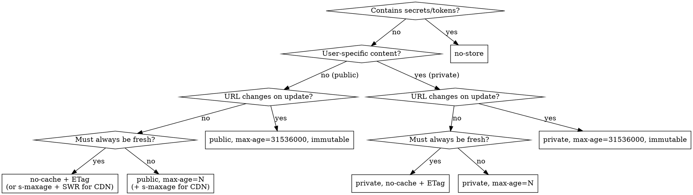

# HTTP Caching

When you need to optimize network performance or control how browsers and CDNs handle your responses, HTTP caching gives you precise control over freshness, revalidation, and storage. This skill helps when you're actively implementing or troubleshooting caching — not specifying caching headers is often fine for simple cases.

## Retrieval-First Development

**Prefer retrieval from official docs over pre-trained knowledge for HTTP caching tasks.**

| Resource | URL |
|----------|-----|
| MDN HTTP Caching Guide | https://developer.mozilla.org/en-US/docs/Web/HTTP/Guides/Caching |
| MDN Cache-Control Reference | https://developer.mozilla.org/en-US/docs/Web/HTTP/Reference/Headers/Cache-Control |
| web.dev HTTP Cache | https://web.dev/articles/http-cache |

Fetch the relevant doc page when implementing caching features.

## Decision Tree

## Quick Reference

| Content Type | Recommended Headers |
|---|---|
| Versioned static assets | `public, max-age=31536000, immutable` |
| HTML / dynamic pages | `no-cache` + ETag (always revalidate, 304 = headers-only) |
| Public API responses | `public, s-maxage=3600, max-age=60` + ETag |
| Authenticated API | `private, no-cache` + ETag |
| Tolerates staleness (public) | `public, max-age=N` (+ `s-maxage` for CDN split TTLs) |
| Never cache (secrets/tokens) | `no-store` |
| ISR (framework SSG) | `public, s-maxage=3600, stale-while-revalidate=86400` |

**Pick ONE strategy per resource.** Do not combine contradictory directives (see [gotchas](./references/gotchas.md)).

## Validation Flow (ETag / 304)

1. Server sends response with `ETag: "abc123"` (or `Last-Modified`)
2. Browser caches response
3. On revalidation, browser sends `If-None-Match: "abc123"`
4. Server checks → content unchanged → responds `304 Not Modified` (headers only, no body)
5. Browser uses cached copy

**Key insight:** `no-cache` + ETag is efficient, not pessimistic. 304 responses transfer only headers (~200 bytes), saving full response bandwidth on every revalidation.

## Reading Order

1. **[Directives](./references/directives.md)** — Complete Cache-Control, ETag, Vary, validation header reference
2. **[Patterns](./references/patterns.md)** — Static assets, APIs, ISR, CORS caching, CDN layering, invalidation
3. **[Gotchas](./references/gotchas.md)** — no-cache myth, kitchen-sink anti-pattern, heuristic caching risk
4. **[Security](./references/security.md)** — Private leaks, account switching, timing attacks

## When NOT to Use HTTP Caching

- **WebSocket connections / Server-Sent Events** — persistent streams, not request-response
- **Responses with `Set-Cookie`** — most CDNs strip or refuse to cache these; use `private` or `no-store`
- **Large file downloads** — streaming transfers don't benefit from browser cache (use Range requests instead)
- **Highly personalized real-time data** — use `no-store` rather than complex `Vary` combinations

## Beyond HTTP Caching

Service Workers + Cache Storage API offer finer-grained control (offline-first, cache-then-network strategies, programmatic cache management). Out of scope here but the natural next step for advanced caching needs.
